title: YunoHost - An essential building block to decentralize internet
class: animation-fade
layout: true

---

class: impact

.center[

]

## The operating system
## to build the decentralized Internet

*Aleks - on behalf of the YunoHost project*

---

.center[
 
# **Surveillance Capitalism**
### [GAFAM et al.]
 
 
# **Global Surveillance Madness**
### [FVEY et al.]
]

---

class: full

.center[

]

---

.center[
# <red>**The Evil Cloud**</red>

]

---

 

.center[
<small>
### concrete, 
### straightfoward, 
### **not-just-for-nerds**, 
### scalable,
### long-term 
</small>
## **alternatives?**
]

---

.center[
 
 
### **If Google disappeared tomorrow,**
 
### **How would we** 
### **build <emph>the decentralized internet</emph> ?**
]

---

.center[
# FOSS services / social media

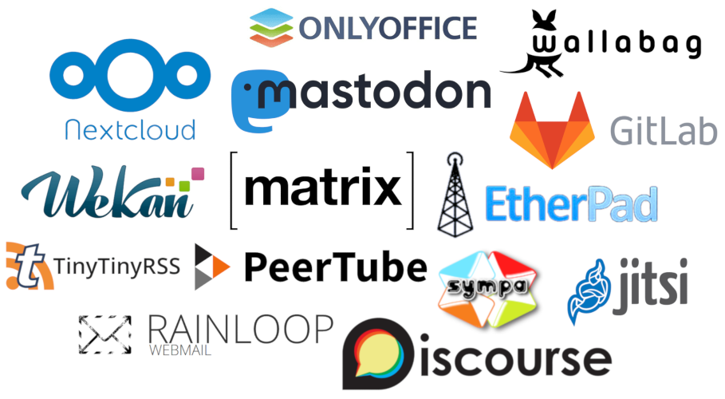
]

---

class: full

.center[
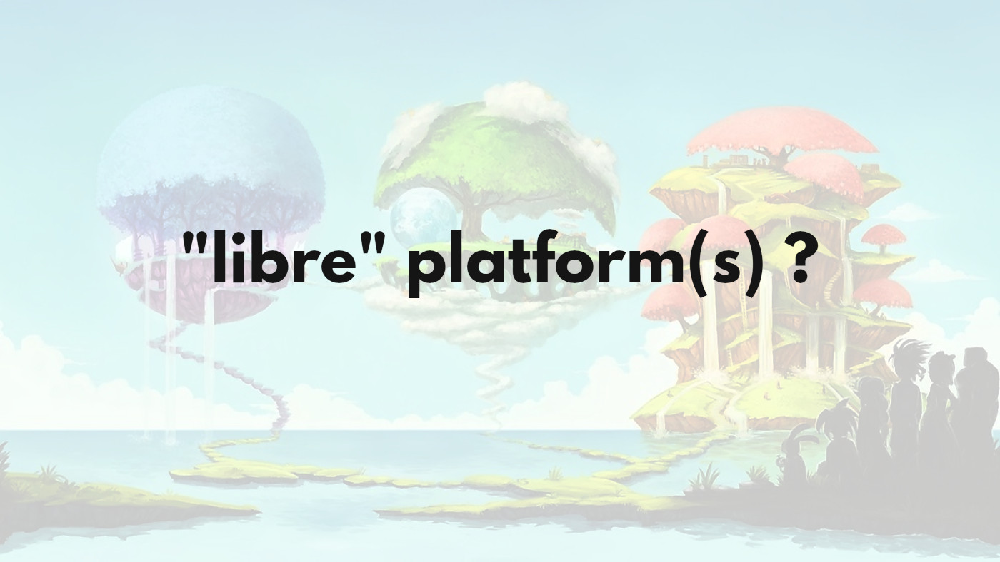
]

---

class: img-560

.center[
### Framasoft's De-google-ify campaign

]

---

.center[
<!--
<video width="auto" height="600" autoplay loop>
  <source src="img/framasoft.mp4" type="video/mp4">
Your browser does not support the video tag.
</video>
-->

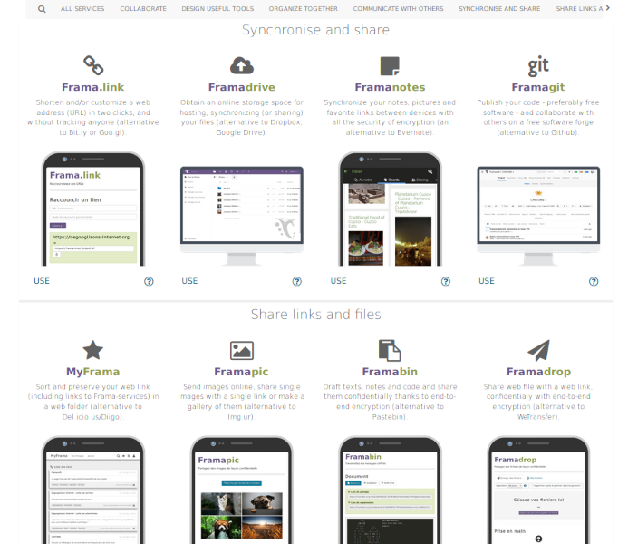
]

---

.center[
# But #1
### The point is <emph>**decentralization!**</emph>

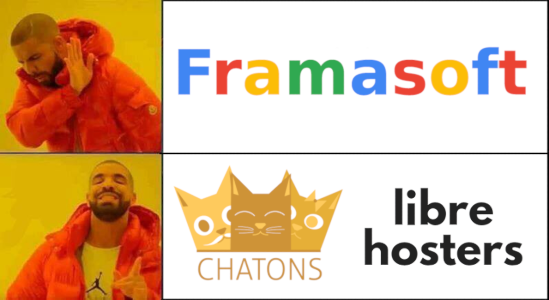
]

- **make it easy** to replicate Framasoft's model
- **spread it** into a variety of local entities (CHATONS, LibreHosters)

---

.center[
# But #2
### What about <emph>**emails**</emph> and <emph>**file storage**</emph>

 
Complex, expensive, 
not easy for small-scale third parties
 
 

But what if you had 
**your own server** 
<small>and data on your own drives</small>
]

---

.center[
 
 
 
# We have personal computers
# Why not <emph>**personal servers**</emph>
]

---

.center[
# Server administration is <red>**madness**</red>

time sinkhole 
complicated as hell

# But <emph>**does it has to be?**</emph> 
]

---

class: bigblack

.center[
 
# What's at stake

**<emph>We *won't*</emph>** get rid of surveillance capitalism 
 **<emph>if only a tech elite</emph> 
**can deploy and** <emph>maintain servers</emph>**
]

---

.center[
 

# "The Ubuntu of self-hosting"
]

---

.center[
# Buy a machine 
]

.col-6[
.center[
### At home
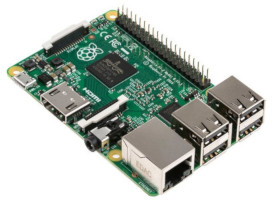

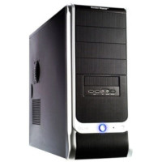
]
]

.col-6[
.center[
### In a datacenter
 
 

]
]

---

.center[
# Install YunoHost
]

.col-6[
.center[
### Pre-installed images

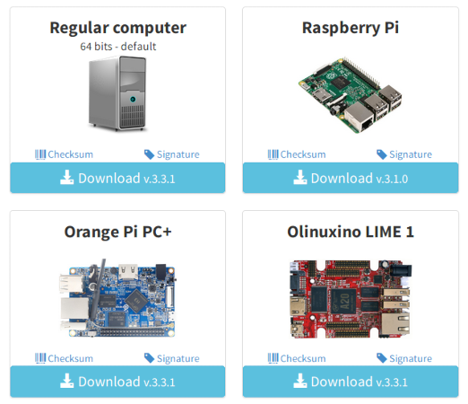
]
]

.col-6[
.center[
### On top of

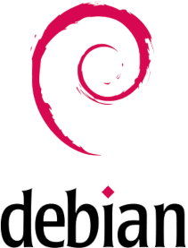

`curl install.yunohost.org `

`| bash` ... ;-)
]
]

---

.center[
# Web admin interface

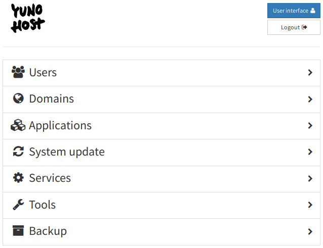
]

---

.center[
# Install apps ... in a few clicks !

<!--
<video width="auto" height="600" autoplay loop>
  <source src="img/apps.mp4" type="video/mp4">
Your browser does not support the video tag.
</video>
-->

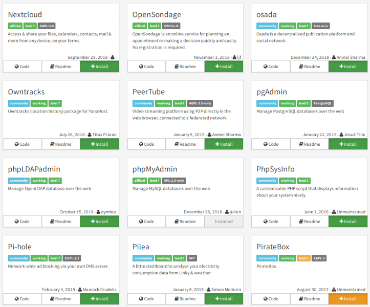
]

---

.center[
# Give access to your friends

<!--
<video width="auto" height="600" autoplay loop>
  <source src="img/sso.mp4" type="video/mp4">
</video>
-->

]

---

.center[
 
 
 
 
# Live demo

you can try it yourself on: 
demo.yunohost.org !
]

---

### In just ~ 30 min / 1h !

- Buy a VPS (or power on your board)
- Install YunoHost
- Choose a domain and admin password
- Create a first user
- Install apps, Let's Encrypt certificate ...
- Send emails

---

# Project status

- **~3000 instances** with happy users ;)
- Vivid community !
- **~10 regular contributors** (100% volunteers)
- More than **100 working apps** !

**<emph>Current goals</emph>**
- smooth the UX, increase robustness
- expand the user base (especially outside the French bubble ;-))
- get funding / grants for sustainability

---

.center[
# Happy users !

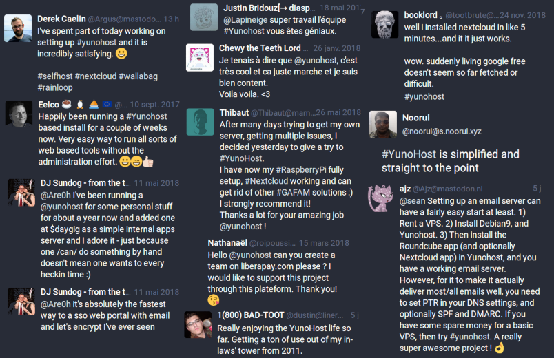
]

---

# Help us !

- Deploy a YunoHost for yourself ;)
- Tell your friends, **organize install parties**
- **Give us feedback on the UX**
- Report issues, test apps and beta releases
- Improve doc and translations

... and if you know how to code:

- Front-end (HTML / CSS / JS)
- App packaging (bash)
- Core (python, general sysadmin knowledge, security, ...)

---

.center[
# Conclusion / summary

If we have the ambition 
to **fight surveillance capitalism** 
we *must*  
reduce the technical and human cost 
of server administration. 

### **YunoHost shows that it can be done**

... yet there's still so much to do! 
For this, **we need your help** ;-)
]

---

class: impact

### Thank you <3 !

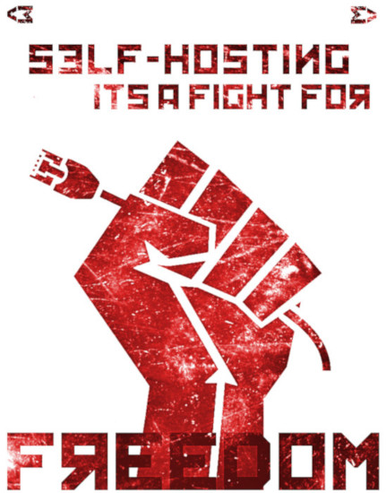

---

---

class: impact

## Moar stuff I have no time to talk about

---

# Contact info

- <small>(In person during FOSDEM!)</small>
- **Mastodon**: `cybre.space/@aleks`
- **GitHub**: `github.com/alexAubin`
- **Matrix**: `@Alekswag:matrix.org`

Find the YunoHost team on :

- **IRC**: `#yunohost` and `#yunohost-dev` on `irc.freenode.org`
- **Matrix**: `#freenode_#yunohost:matrix.org`
- **Forum**: `forum.yunohost.org`
- **Mastodon**: `mastodon.social/@yunohost`

---

.center[
# Naming

« Y U No Host »

]

---

.center[
# Naming (2)

alternatively: « You (K)now Host »

 

]

---

# Features overview

-  **Debian**-based (stable, robust, well-known)
-  Simple & clean **web administration interface**
-  Install **apps** in just a few clicks & questions
-   **Multi-users** with single sign-on (SSO) portal
-   **Email** and instant messaging (XMPP) out of the box
-  **Backups** (and restore!)
- **Let's Encrypt** integration
- Firewall, fail2ban, ...
- Lots of other stuff for things to just work

---

.center[
**YunoHost ecosystem**
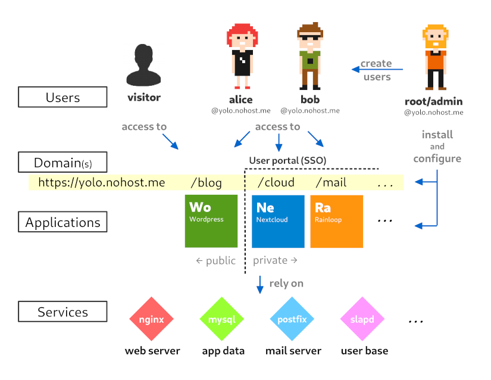
]

---

# Remote backup

.center[
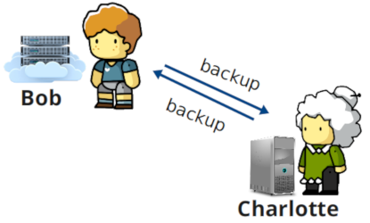
]

- Still work in progress
- Based on Borg Backup
- Remote, deduplicated, encrypted

---

# Friend to friend

.center[
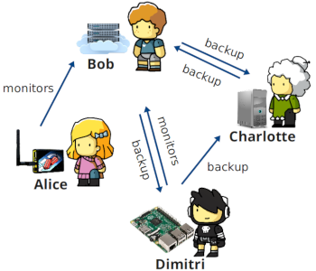
]

- Still thinking about it
- Easily add "friend" server
- Enable service such as monitoring (server up ? DNS conf ? ports forwarding ?)

---

# App C.I. / quality control

.center[
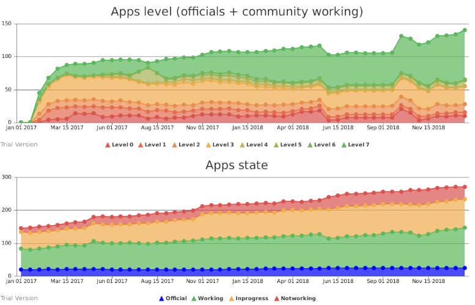
]

---

# Internet cube

.center[
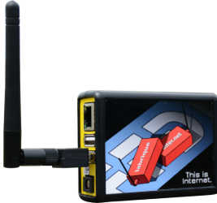
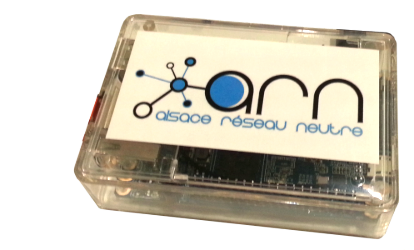
]

- Plug-and-play
- Pre-installed with YunoHost
- VPN from the FFDN
- Wifi hostpot transparently going through the VPN

